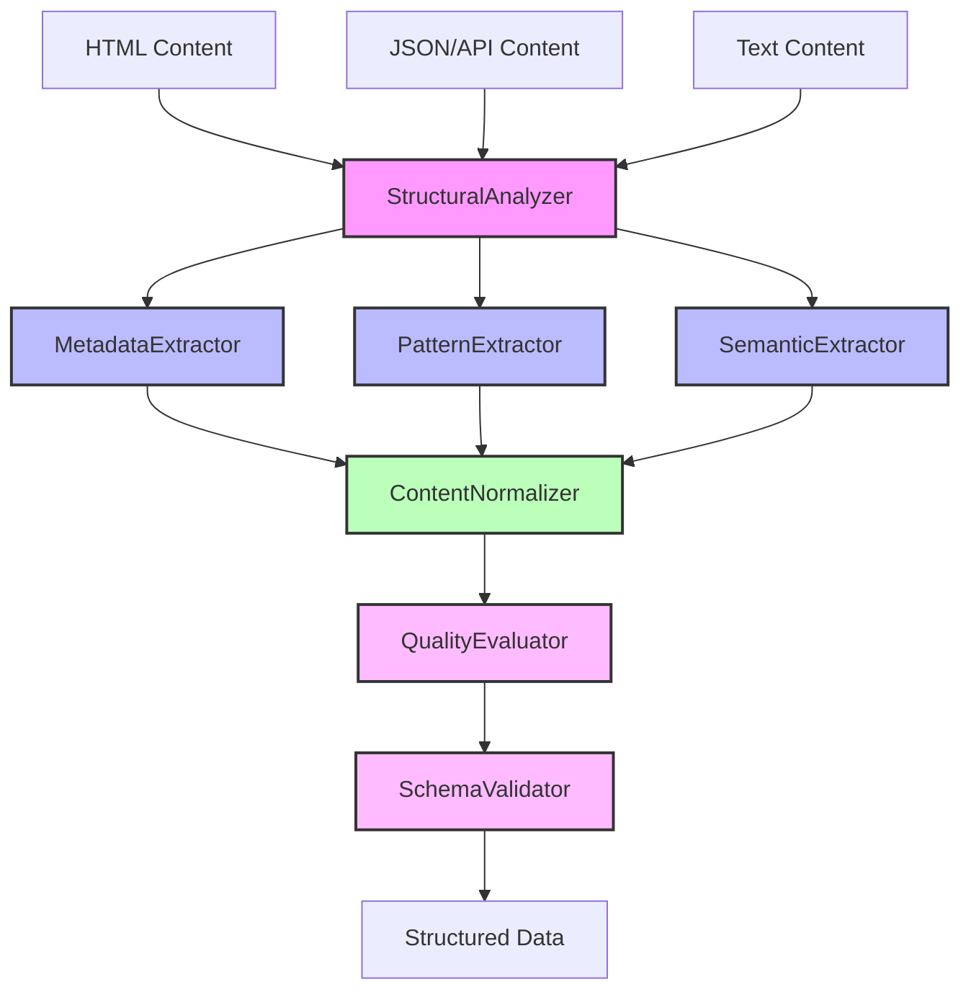
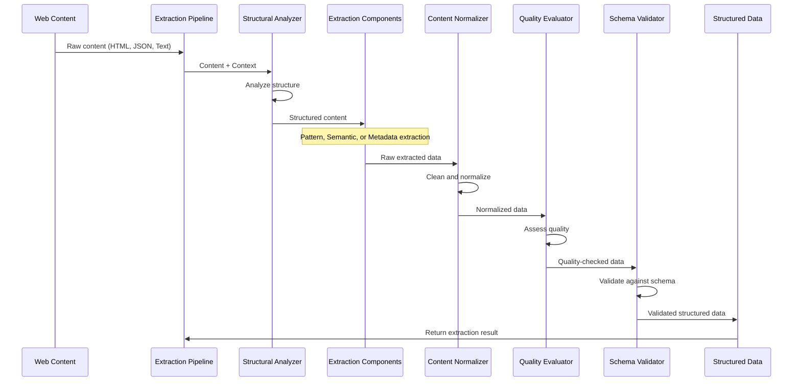

# SmartScrape Universal Extraction Framework

## 1. Architecture Overview

### Component Architecture


### Data Flow Process


### Component Relationships and Responsibilities

- **Core Interfaces and Base Classes**
  - `BaseExtractor`: Base class for all extraction components
  - `PatternExtractor`: Base for pattern-matching extractors
  - `SemanticExtractor`: Base for AI-powered extractors
  - `StructuralAnalyzer`: Base for DOM/content structure analysis
  - `MetadataExtractor`: Base for metadata extraction
  - `ContentNormalizer`: Base for data cleaning/normalization
  - `QualityEvaluator`: Base for quality assessment
  - `SchemaValidator`: Base for schema validation

- **Key Implementation Components**
  - `DOMPatternExtractor`: Extracts data using CSS/XPath patterns
  - `AISemanticExtractor`: Uses AI to extract data semantically
  - `DOMStructuralAnalyzer`: Analyzes HTML document structure
  - `CompositeMetadataExtractor`: Extracts metadata from various formats
  - `ContentNormalizer`: Cleans and standardizes extracted data
  - `QualityEvaluator`: Assesses extraction quality and completeness
  - `SchemaManager`: Manages extraction schemas
  - `SchemaValidator`: Validates data against schemas

### Integration with Other System Components

The Extraction Framework integrates with several core SmartScrape systems:

- **Pipeline Architecture (Batch 4)**
  - Extraction components are implemented as pipeline stages
  - Pipeline registry manages standard and custom extraction pipelines
  - Pipeline context shares data between extraction stages

- **Resource Management (Batch 5)**
  - `SessionManager`: For network requests in extraction
  - `ProxyManager`: For rotating proxies during extraction
  - `RateLimiter`: For respecting rate limits during extraction
  - `CircuitBreaker`: For handling service failures

- **Error Handling (Batch 5)**
  - `RetryManager`: For retrying failed extraction operations
  - `ErrorClassifier`: For classifying extraction errors
  - `FallbackFramework`: For graceful degradation in extraction

- **AI Service (Batch 2)**
  - `AIService`: For semantic extraction operations
  - `ModelSelector`: For choosing appropriate AI models
  - `ContentProcessor`: For optimizing content for extraction

- **HTML Service (Batch 1)**
  - For parsing and processing HTML content
  - For generating selectors for pattern extraction

## 2. Extractor Component Documentation

### BaseExtractor

The foundation interface for all extraction components:

```python
class BaseExtractor(ABC):
    """Base interface for all SmartScrape extraction components."""
    
    def __init__(self, context: Optional[StrategyContext] = None):
        self._context = context
        self._initialized = False
        self._config = {}
    
    @abstractmethod
    def can_handle(self, content: Any, content_type: str = "html") -> bool:
        """Check if this extractor can handle the given content type."""
        pass
    
    @abstractmethod
    def extract(self, content: Any, schema: Optional[Dict[str, Any]] = None, 
               options: Optional[Dict[str, Any]] = None) -> Dict[str, Any]:
        """Extract data from content according to the optional schema."""
        pass
```

Important methods:
- `initialize(config)`: Set up the extractor with configuration
- `shutdown()`: Clean up resources
- `can_handle(content, content_type)`: Check if content can be processed
- `extract(content, schema, options)`: Main extraction method

### PatternExtractor

Base class for extractors that use pattern matching (CSS selectors, XPath, regex):

```python
class PatternExtractor(BaseExtractor):
    """Base class for extractors that use pattern matching."""
    
    @abstractmethod
    def generate_patterns(self, content: Any, schema: Optional[Dict[str, Any]] = None) -> Dict[str, Any]:
        """Generate patterns for extracting data from content."""
        pass
    
    @abstractmethod
    def match_patterns(self, content: Any, patterns: Dict[str, Any]) -> Dict[str, Any]:
        """Match patterns against content to extract data."""
        pass
```

Implementation: `DOMPatternExtractor`
- Uses HTML DOM structure for efficient pattern-based extraction
- Can automatically generate CSS selectors based on field names
- Handles lists, tables, and nested data structures

### SemanticExtractor

Base class for extractors that use AI understanding:

```python
class SemanticExtractor(BaseExtractor):
    """Base class for extractors that use semantic understanding."""
    
    @abstractmethod
    def extract_semantic_content(self, content: Any, schema: Optional[Dict[str, Any]] = None) -> Dict[str, Any]:
        """Extract data based on semantic understanding of content."""
        pass
```

Implementation: `AISemanticExtractor`
- Uses AI models to understand content meaning
- Can extract data based on context and relationships
- Handles unstructured content effectively
- Integrates with SmartScrape AI Service

### StructuralAnalyzer

Base class for analyzing content structure:

```python
class StructuralAnalyzer(BaseExtractor):
    """Base class for analyzing content structure."""
    
    @abstractmethod
    def analyze_structure(self, content: Any) -> Dict[str, Any]:
        """Analyze structure of content."""
        pass
```

Implementation: `DOMStructuralAnalyzer`
- Analyzes HTML document structure
- Identifies content sections and relationships
- Detects patterns like listings, tables, and forms
- Provides structural context for other extractors

### MetadataExtractor

Base class for extracting metadata:

```python
class MetadataExtractor(BaseExtractor):
    """Base class for extracting metadata."""
    
    @abstractmethod
    def extract_metadata(self, content: Any) -> Dict[str, Any]:
        """Extract metadata from content."""
        pass
```

Implementation: `CompositeMetadataExtractor`
- Extracts metadata from multiple sources
- Handles standard HTML meta tags
- Extracts Open Graph and Twitter Card metadata
- Processes JSON-LD, Microdata, and RDFa

### ContentNormalizer

Base class for normalizing extracted data:

```python
class ContentNormalizer(BaseExtractor):
    """Base class for normalizing content."""
    
    @abstractmethod
    def normalize(self, data: Dict[str, Any], schema: Optional[Dict[str, Any]] = None) -> Dict[str, Any]:
        """Normalize data according to the schema."""
        pass
```

Implementation: `ContentNormalizer`
- Cleans text (whitespace, HTML fragments)
- Normalizes dates to standard format
- Standardizes numbers and currencies
- Converts units (imperial/metric)

Concrete implementation: `ContentNormalizerImpl`
- Provides comprehensive data normalization capabilities
- Automatically detects data types and applies appropriate normalization 
- Handles text, dates, prices, measurements, addresses, phone numbers, and more
- Supports both metric and imperial unit systems
- Performs recursive normalization for nested objects and arrays

### QualityEvaluator

Base class for evaluating extraction quality:

```python
class QualityEvaluator(BaseExtractor):
    """Base class for evaluating extraction quality."""
    
    @abstractmethod
    def evaluate(self, data: Dict[str, Any], schema: Optional[Dict[str, Any]] = None) -> Dict[str, Any]:
        """Evaluate quality of extracted data."""
        pass
```

Implementation: `QualityEvaluator`
- Assesses data completeness
- Checks field validity
- Calculates confidence scores
- Identifies potential extraction errors

### SchemaValidator

Base class for validating against schemas:

```python
class SchemaValidator(BaseExtractor):
    """Base class for validating data against a schema."""
    
    @abstractmethod
    def validate(self, data: Dict[str, Any], schema: Dict[str, Any]) -> Dict[str, Any]:
        """Validate data against schema."""
        pass
```

Implementation: `SchemaValidator`
- Validates data structure
- Enforces field types
- Handles required fields
- Supports complex validation rules

## 3. Pipeline Integration Documentation

### Extraction Pipeline Stages

The Extraction Framework components can be integrated as pipeline stages:

1. **StructuralAnalysisStage**
   - Analyzes page structure and identifies sections
   - Sets content type and structure info in pipeline context
   - Provides structural guidance for downstream extractors

2. **MetadataExtractionStage**
   - Extracts metadata from various formats
   - Adds metadata to pipeline context
   - Provides complementary data for main extraction

3. **PatternExtractionStage**
   - Uses DOM patterns to extract structured data
   - Works best with regular, structured content
   - Utilizes structural analysis for pattern generation

4. **SemanticExtractionStage**
   - Uses AI to extract data semantically
   - Works well with irregular or unstructured content
   - Falls back to pattern extraction if AI fails

5. **ContentNormalizationStage**
   - Cleans and standardizes extracted data
   - Converts formats based on schema requirements
   - Resolves inconsistencies in extracted data

6. **QualityEvaluationStage**
   - Assesses extraction quality and confidence
   - Marks low-quality or missing fields
   - May trigger re-extraction for poor results

7. **SchemaValidationStage**
   - Validates data against defined schemas
   - Enforces schema compliance
   - Applies defaults and type conversions as needed

### Standard Pipeline Configurations

The framework provides several standard pipeline configurations:

1. **ProductExtractionPipeline**
   ```
   FetchContentStage → StructuralAnalysisStage → MetadataExtractionStage → 
   PatternExtractionStage → SemanticExtractionStage → ContentNormalizationStage → 
   QualityEvaluationStage → SchemaValidationStage
   ```
   Best for: E-commerce product pages

2. **ArticleExtractionPipeline**
   ```
   FetchContentStage → StructuralAnalysisStage → MetadataExtractionStage → 
   SemanticExtractionStage → ContentNormalizationStage → 
   QualityEvaluationStage → SchemaValidationStage
   ```
   Best for: News articles, blog posts

3. **ListingExtractionPipeline**
   ```
   FetchContentStage → StructuralAnalysisStage → 
   PatternExtractionStage → ContentNormalizationStage → 
   QualityEvaluationStage → SchemaValidationStage
   ```
   Best for: Product listings, search results

4. **GeneralPurposeExtractionPipeline**
   ```
   FetchContentStage → StructuralAnalysisStage → MetadataExtractionStage → 
   PatternExtractionStage → SemanticExtractionStage → ContentNormalizationStage → 
   QualityEvaluationStage → SchemaValidationStage
   ```
   Best for: Universal extraction, unknown content types

### Custom Pipeline Creation

Creating custom extraction pipelines:

```python
# Create a custom pipeline configuration
custom_pipeline_config = {
    "name": "CustomProductExtraction",
    "stages": [
        {
            "stage": "fetch_content",
            "config": {
                "use_browser": True,
                "wait_for_selectors": [".product-details"]
            }
        },
        {
            "stage": "structural_analysis",
            "config": {
                "identify_sections": True
            }
        },
        {
            "stage": "pattern_extraction",
            "config": {
                "selector_generation": "auto",
                "schema": "product_schema"
            }
        },
        {
            "stage": "content_normalization",
            "config": {
                "clean_html": True,
                "standardize_dates": True
            }
        },
        {
            "stage": "schema_validation",
            "config": {
                "schema": "product_schema",
                "strict": True
            }
        }
    ]
}

# Register the custom pipeline
pipeline_registry = context.get_service("pipeline_registry")
pipeline_registry.register_pipeline_config(custom_pipeline_config)

# Create pipeline instance
pipeline = pipeline_registry.create_pipeline("CustomProductExtraction")
```

### Context Requirements and Outputs

Each extraction stage requires specific context and produces outputs:

| Stage | Context Requirements | Outputs |
|-------|----------------------|---------|
| StructuralAnalysis | Raw content, URL | Content type, Structure info, Section mappings |
| MetadataExtraction | Content | Metadata fields (title, description, etc.) |
| PatternExtraction | Content, Structure info, Schema | Extracted data fields |
| SemanticExtraction | Content, Structure info, Schema | Extracted data fields |
| ContentNormalization | Extracted data | Normalized data fields |
| QualityEvaluation | Normalized data, Schema | Quality scores, Confidence metrics |
| SchemaValidation | Normalized data, Schema | Validated data, Validation results |

### Error Handling and Fallbacks

The extraction framework implements robust error handling using Batch 5 components:

1. **RetryManager Integration**
   - Automatic retries for transient errors
   - Configurable retry strategies for different error types
   - Exponential backoff for rate limiting

   ```python
   @retry(max_attempts=3, retry_on=["TransientError", "RateLimitError"])
   async def extract_semantic_content(self, content, schema):
       # Extraction logic
   ```

2. **CircuitBreaker Integration**
   - Prevents cascading failures in extraction components
   - Automatic fallback to alternative extraction methods
   - Self-healing with periodic testing

   ```python
   # In SemanticExtractionStage
   @circuit_breaker.circuit_breaker("ai_extraction")
   async def extract_with_circuit_breaker():
       return await self.extractor.extract_semantic_content(content, schema)
   ```

3. **Fallback Framework**
   - Progressive degradation in extraction capabilities
   - Fallback chains from specific to general extractors
   - Result aggregation from multiple extractors

   ```python
   # Extract data with fallback chain
   result = fallback_chain.extract(content, schema)
   ```

4. **Quality-Based Fallbacks**
   - Trigger fallbacks based on extraction quality
   - Try alternative methods if quality is below threshold
   - Combine results from multiple methods if needed

## 4. Extension Guidelines

### Creating Custom Extractors

To create a custom extractor:

1. Choose the appropriate base class:
   - `PatternExtractor` for pattern-based extraction
   - `SemanticExtractor` for AI-based extraction
   - `BaseExtractor` for completely custom extractors

2. Implement required methods:
   - `can_handle()`: Determine if content is compatible
   - `extract()`: Main extraction logic
   - Any base class-specific methods

3. Example custom extractor:

```python
class JSONPathExtractor(PatternExtractor):
    """Extract data from JSON using JSONPath expressions."""
    
    def can_handle(self, content: Any, content_type: str = "json") -> bool:
        """Check if content is JSON and can be handled."""
        if content_type.lower() == "json":
            return True
        if isinstance(content, str):
            try:
                json.loads(content)
                return True
            except:
                pass
        return isinstance(content, dict) or isinstance(content, list)
    
    def extract(self, content: Any, schema: Optional[Dict[str, Any]] = None, 
               options: Optional[Dict[str, Any]] = None) -> Dict[str, Any]:
        """Extract data using JSONPath expressions."""
        # Implementation details
    
    def generate_patterns(self, content: Any, schema: Optional[Dict[str, Any]] = None) -> Dict[str, Any]:
        """Generate JSONPath expressions for fields in schema."""
        # Implementation details
    
    def match_patterns(self, content: Any, patterns: Dict[str, Any]) -> Dict[str, Any]:
        """Apply JSONPath expressions to extract data."""
        # Implementation details
```

4. Register the extractor:

```python
# Get service registry
service_registry = context.get_service("service_registry")

# Register custom extractor
service_registry.register_service("json_path_extractor", JSONPathExtractor())
```

### Implementing Specialized Normalizers

To create a custom normalizer:

1. Extend `ContentNormalizer`:

```python
class SpecializedNormalizer(ContentNormalizer):
    """Specialized normalizer for specific data types."""
    
    def normalize(self, data: Dict[str, Any], schema: Optional[Dict[str, Any]] = None) -> Dict[str, Any]:
        """Normalize data according to the schema."""
        # Custom normalization logic
        
    def normalize_field(self, field_name: str, field_value: Any, field_schema: Dict[str, Any]) -> Any:
        """Normalize a specific field based on its schema."""
        # Custom field normalization
```

2. Create specialized normalization methods:

```python
def normalize_product_dimensions(self, dimensions: str) -> Dict[str, float]:
    """Convert dimension strings like '10 x 5 x 3 inches' to structured data."""
    # Implementation
```

### Adding New Schema Types

To add new schema types:

1. Define the schema structure:

```python
product_variation_schema = {
    "type": "object",
    "properties": {
        "variation_id": {"type": "string"},
        "attributes": {
            "type": "object",
            "additionalProperties": {
                "type": "string"
            }
        },
        "price": {"type": "number"},
        "availability": {"type": "string"}
    },
    "required": ["variation_id", "attributes"]
}
```

2. Register with the `SchemaManager`:

```python
schema_manager = context.get_service("schema_manager")
schema_manager.register_schema("product_variation", product_variation_schema)
```

3. Add custom validation:

```python
# Add custom validator for a field
schema_manager.add_field_validator(
    "product_variation", 
    "availability", 
    lambda value: value in ["in_stock", "out_of_stock", "preorder"]
)
```

### Creating Custom Validation Rules

To create custom validation rules:

1. Define a validation function:

```python
def validate_isbn(value: str) -> bool:
    """Validate ISBN-13 format."""
    if not value or not isinstance(value, str):
        return False
    
    # Remove hyphens and spaces
    isbn = value.replace("-", "").replace(" ", "")
    
    # Check length
    if len(isbn) != 13:
        return False
    
    # Check if all characters are digits
    if not isbn.isdigit():
        return False
    
    # Calculate and verify checksum
    # ISBN-13 checksum calculation logic
    
    return True
```

2. Register with the validator:

```python
schema_validator = context.get_service("schema_validator")
schema_validator.register_validator("isbn", validate_isbn)
```

3. Use in schema definition:

```python
book_schema = {
    "type": "object",
    "properties": {
        "title": {"type": "string"},
        "isbn": {
            "type": "string",
            "validator": "isbn"
        }
    }
}
```

### Building Specialized Extraction Pipelines

To create a specialized extraction pipeline:

1. Define custom extraction stages:

```python
class BookExtractionStage(PipelineStage):
    """Specialized stage for book data extraction."""
    
    @property
    def name(self) -> str:
        return "book_extraction"
    
    async def process(self, data: Dict[str, Any], context: PipelineContext) -> Dict[str, Any]:
        """Extract book-specific data."""
        # Implementation
```

2. Register the custom stage:

```python
pipeline_registry = context.get_service("pipeline_registry")
pipeline_registry.register_stage("book_extraction", BookExtractionStage)
```

3. Create a pipeline configuration:

```python
book_pipeline_config = {
    "name": "BookExtractionPipeline",
    "stages": [
        {"stage": "fetch_content"},
        {"stage": "structural_analysis"},
        {"stage": "metadata_extraction"},
        {"stage": "book_extraction", "config": {"extract_toc": True}},
        {"stage": "content_normalization"},
        {"stage": "quality_evaluation"},
        {"stage": "schema_validation", "config": {"schema": "book_schema"}}
    ]
}

pipeline_registry.register_pipeline_config(book_pipeline_config)
```

## 5. Performance Optimization

### Content Preprocessing Strategies

Optimizing content before extraction:

1. **HTML Preprocessing**
   - Remove unnecessary elements (comments, scripts, styles)
   - Simplify complex DOM structures
   - Extract main content area only
   
   ```python
   # Use HTML Service for preprocessing
   html_service = context.get_service("html_service")
   main_content = html_service.extract_main_content(html)
   ```

2. **Content Truncation**
   - Process only relevant portions of large documents
   - Use structure information to focus on important sections
   - Set token limits for AI model processing
   
   ```python
   # Use Content Processor for token optimization
   content_processor = context.get_service("content_processor")
   preprocessed = content_processor.preprocess_for_extraction(
       content, max_tokens=4000, focus_selectors=[".main-content"]
   )
   ```

3. **Token Optimization for AI**
   - Remove boilerplate content
   - Compress repetitive structures
   - Preserve semantic meaning while reducing token count
   
   ```python
   # Optimize for token efficiency
   optimized_content = content_processor.optimize_for_model(
       content, model="gpt-4", preserve_structure=True
   )
   ```

### Extraction Caching

Implementing caching to improve performance:

1. **Result Caching**
   - Cache extraction results by URL and content hash
   - Invalidate cache on schema changes
   - Set appropriate TTL based on content type
   
   ```python
   # Use CacheManager for extraction results
   cache_manager = context.get_service("cache_manager")
   cache_key = f"extraction:{url_hash}:{schema_hash}"
   
   # Try to get from cache
   cached_result = await cache_manager.get(cache_key)
   if cached_result:
       return cached_result
   
   # Perform extraction
   result = await extractor.extract(content, schema)
   
   # Cache the result
   await cache_manager.set(cache_key, result, ttl=3600)
   ```

2. **AI Response Caching**
   - Cache AI extraction responses
   - Apply cache warming for common extraction patterns
   - Implement cache hierarchies (L1/L2) for performance
   
   ```python
   # AI Service already implements caching
   ai_service = context.get_service("ai_service")
   ```

3. **Pattern Caching**
   - Cache generated CSS selectors and patterns
   - Share patterns across similar pages
   - Evolve pattern cache based on extraction success
   
   ```python
   # Cache patterns by domain and page type
   pattern_cache_key = f"patterns:{domain}:{page_type}"
   ```

### Resource Management

Managing resources for optimal extraction:

1. **Connection Pooling**
   - Reuse HTTP connections for multiple extractions
   - Configure optimal pool sizes based on workload
   - Implement connection lifecycle management
   
   ```python
   # Use SessionManager for connection management
   session_manager = context.get_service("session_manager")
   ```

2. **Memory Management**
   - Implement streaming for large content
   - Use generators for processing large lists
   - Clean up large objects after extraction
   
   ```python
   # Process large listings in chunks
   async for item_batch in extractor.extract_items_streaming(content, batch_size=100):
       # Process each batch
       process_item_batch(item_batch)
   ```

3. **CPU Utilization**
   - Balance parallel extraction workloads
   - Set appropriate thread pool sizes
   - Monitor and adjust based on system load
   
   ```python
   # Configure worker pools
   worker_pool = context.get_service("worker_pool")
   worker_pool.set_max_workers(min(32, os.cpu_count() * 4))
   ```

### Concurrent Extraction

Implementing parallel processing:

1. **Parallel Stage Execution**
   - Execute independent stages concurrently
   - Merge results from parallel extractors
   - Implement pipeline fork-join patterns
   
   ```python
   # Execute pattern and semantic extraction in parallel
   pattern_task = asyncio.create_task(pattern_extractor.extract(content, schema))
   semantic_task = asyncio.create_task(semantic_extractor.extract(content, schema))
   
   # Wait for both to complete
   pattern_result, semantic_result = await asyncio.gather(pattern_task, semantic_task)
   
   # Merge results
   merged_result = merge_extraction_results(pattern_result, semantic_result)
   ```

2. **Batch Processing**
   - Process multiple items in parallel
   - Use task queues for large extraction jobs
   - Implement priority-based scheduling
   
   ```python
   # Process multiple items concurrently
   async def extract_batch(items, schema):
       tasks = [extractor.extract(item, schema) for item in items]
       return await asyncio.gather(*tasks)
   ```

3. **Pipeline Parallelism**
   - Run multiple pipeline instances in parallel
   - Implement pipelining for sequential extractions
   - Balance load across pipeline stages
   
   ```python
   # Run multiple pipeline instances
   async def run_parallel_pipelines(urls, pipeline_name, max_concurrent=10):
       semaphore = asyncio.Semaphore(max_concurrent)
       
       async def extract_with_limit(url):
           async with semaphore:
               pipeline = pipeline_registry.create_pipeline(pipeline_name)
               return await pipeline.run({"url": url})
       
       tasks = [extract_with_limit(url) for url in urls]
       return await asyncio.gather(*tasks)
   ```

### Memory Optimization Techniques

Reducing memory usage in extraction:

1. **Stream Processing**
   - Process large documents incrementally
   - Implement SAX-like parsing for huge XML/HTML
   - Use generators and async iterators
   
   ```python
   # Stream processing large documents
   async for element in html_service.stream_elements(html, selector="article"):
       # Process each element individually
       result = await extractor.extract(element, schema)
       yield result
   ```

2. **Data Structure Optimization**
   - Use compact data structures
   - Implement field filtering to extract only needed data
   - Use object pooling for repetitive structures
   
   ```python
   # Extract only required fields
   subset_extractor = FieldSubsetExtractor(
       core_extractor=base_extractor,
       critical_fields=["title", "price", "description"]
   )
   ```

3. **Garbage Collection Control**
   - Force collection after large extractions
   - Implement reference counting for large objects
   - Schedule memory cleanup during idle periods
   
   ```python
   # Clear memory after large extraction
   def cleanup_after_extraction():
       # Clear caches
       extractor.clear_caches()
       # Suggest garbage collection
       gc.collect()
   ```